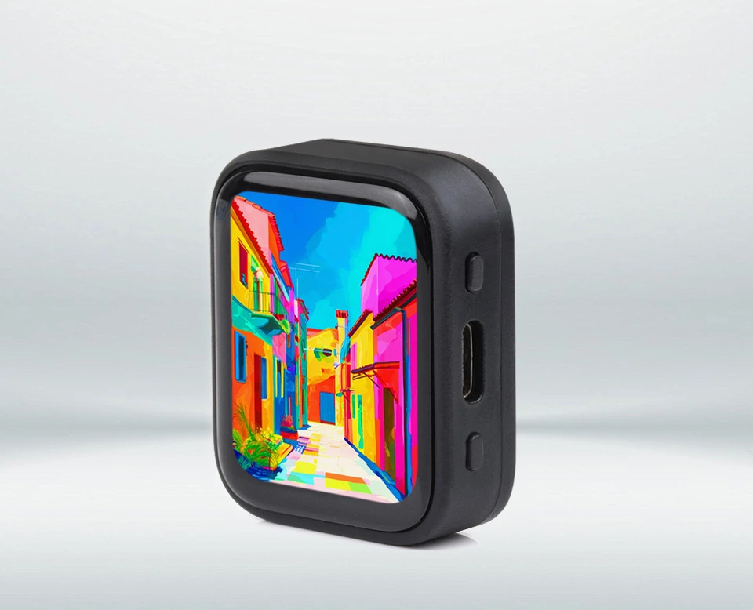
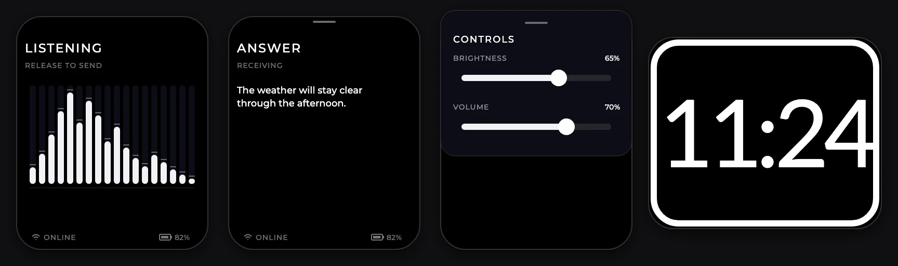

# ChatESP

**Hold. Ask. Hear the answer.**

ChatESP turns a small ESP32-S3 board into a privacy-conscious, voice-first
assistant. Hold one button to speak, release it to send, and get a short answer
on the AMOLED display and speaker. No phone is necessary during normal use.



*Official Waveshare product photo. The screen shows the factory demo, not
ChatESP.*

[Buy the Waveshare V2 board](https://www.waveshare.com/esp32-s3-touch-amoled-1.8.htm)
· [Read the hardware guide](docs/hardware.md)
· [See the architecture](docs/architecture.md)

> [!IMPORTANT]
> Buy the V2 board with the CO5300 display and CST820 touch controller.
> Waveshare states that shipments changed to V2 on May 30, 2026. ChatESP keeps
> an original-board driver path, but original-board display support is not
> complete.

## Why ChatESP?

- **One-button voice:** Hold the bottom PWR button to record. Release it to
  submit. There is no wake word and no background microphone stream.
- **Fast cold wake:** Production system-off recognizes each bottom PWR press
  in 128 ms and starts the board before it knows if the press will be short or
  held. The splash appears before touch setup. A continued hold enters
  listening at the normal recording threshold without a second panel start.
- **Fast spoken replies:** Text appears while the model works. The first
  sentence starts speech early. One second request contains the complete
  remaining spoken answer.
- **Useful tools:** Search the web, find and show images, run bounded
  calculations, draw line plots, and control or restart the device by voice.
- **Short follow-up chat:** Continue the same conversation for 30 seconds after
  the complete response action finishes or fails. Speech, a requested image or
  plot, and the last display update finish before this window starts. The
  device then clears the thread and sleeps.
- **Travel Clock:** Use the large AMOLED as a landscape 24-hour clock with a
  one-pixel seconds line. Clock sleeps after five minutes on battery and stays
  on while external power is connected.
- **Touch interaction:** Drag long answers directly under your finger. The text
  keeps its momentum and resists the top and bottom edges. Pull down the top
  handle to change brightness or volume. You can also change both values by
  voice.
- **Readable chat:** Use the iOS app to set ChatESP text and icon size from
  100% through 200%. Clock keeps its fixed layout and type size.
- **Clear radio and power state:** The footer shows the active Wi-Fi or secure
  BLE link, three Wi-Fi signal levels, battery charge state, and battery
  percentage. Development firmware also shows `DEV` at the footer center.
  Battery operation stops at 5 percent to protect the cell.
- **User-controlled memory:** Ask ChatESP to save, remove, list, or compact up
  to ten short facts.
- **Optional iOS setup:** Provision any number of devices over authenticated,
  encrypted BLE. The app keeps provider secrets in Keychain and automatically
  sends each changed configuration. It refreshes unchanged settings at most
  once every 10 minutes. While the secure link is active, the app also
  supplies the device network path.
- **Clear model choices:** Search compatible chat, transcription, and speech
  models with their prices. Select English and French voices from the speech
  model's published voice list.
- **Replaceable providers:** Chat, speech, search, and tools use narrow
  interfaces. You can change a provider without changes to the conversation
  state machine.

## See it in action



*Source-accurate renders from `firmware/main/ui.cpp`. They use the 368 by 448
ChatESP layout and the 448 by 368 Clock layout. They are not physical test
photos.*

1. Hold the bottom PWR button and ask a question.
2. Release the button. ChatESP transcribes the request and selects the direct,
   web, image, device-control, calculation, or memory route.
3. Read the streamed answer and hear the first sentence, then the remaining
   answer without a new request for each sentence.
4. Ask a follow-up within 30 seconds, or let ChatESP clear the thread and
   sleep.

A short top-button press changes between ChatESP and Clock. A short PWR-button
press without a recording requests sleep. Pull down from the top edge for the
brightness and volume controls. Hold PWR and BOOT together for five seconds to
restart the device.

## Hardware

ChatESP targets the
[Waveshare ESP32-S3-Touch-AMOLED-1.8 V2](https://www.waveshare.com/esp32-s3-touch-amoled-1.8.htm).
The board includes the display, microphone, speaker, power controller, and both
buttons.

| Part | Specification |
| --- | --- |
| Processor | Dual-core ESP32-S3, up to 240 MHz |
| Memory | 16 MB flash and 8 MB PSRAM |
| Display | 1.8-inch, 368 by 448 capacitive-touch AMOLED |
| Audio | ES8311 codec, onboard microphone, and onboard speaker |
| Wireless | 2.4 GHz Wi-Fi and Bluetooth Low Energy |
| Motion and time | QMI8658 six-axis IMU and PCF85063A RTC |
| Power | AXP2101 PMU, USB-C, and 3.7 V battery connector |
| Storage | MicroSD slot |

You also need a USB-C cable and an OpenRouter key. Cloud requests can use the
iOS companion through BLE or a configured 2.4 GHz Wi-Fi network. Add a Brave
Search key for web and image search. A battery is optional.

See the
[official board documentation](https://docs.waveshare.com/ESP32-S3-Touch-AMOLED-1.8)
for the pinout, dimensions, and version label.

## Privacy and security

ChatESP keeps the privacy rules small and explicit:

- Raw microphone audio stays in memory and is erased after transcription.
- Logs do not contain audio, chat text, credentials, stable device IDs, or
  precise location.
- The iOS app stores secrets in Keychain and sends settings only over an
  authenticated, encrypted BLE connection.
- The device sends only an approximate location to the model. It does not log
  or store the live value.
- Network calls, buffers, retries, tool rounds, and conversation history have
  fixed limits.
- ChatESP does not enable secure boot, flash encryption, or encrypted NVS,
  because these features can cause an irreversible eFuse write.

Production settings and all BLE bonds use plaintext NVS. Saved memories also
use plaintext NVS. A person with physical access to the flash can read them.
Do not store secrets as memories. See
[the architecture](docs/architecture.md#secret-lifecycle) for the complete data
lifecycle.

## Project status

ChatESP is in active development. The V2 development device has passed these
physical checks:

- black-screen start without a white frame;
- bottom-button hold-to-talk;
- streamed answer text and clear streamed speech;
- secure iPhone BLE provisioning and bond restoration;
- five cloud requests in one voice turn through the iPhone BLE proxy;
- Wi-Fi cloud fallback after the phone proxy is unavailable;
- button preemption;
- strongest-access-point selection; and
- Wi-Fi modem power saving.

Automated tests cover pure state, protocol, privacy, and bounded-buffer paths.
The firmware already contains the terminal interface, voice pipeline, web and
image search, restricted MicroPython, user-controlled memory, BLE
provisioning, device controls, travel Clock, and sleep paths.

The app can store an empty Wi-Fi or OpenRouter value. Local Clock and device
controls remain available. Cloud features need an OpenRouter key. They need
either the secure phone proxy or stored Wi-Fi credentials.

The following physical acceptance gates are still open: full-screen image
color and crop, Clock rotation and rounded-corner rendering, top-button mode
switching, Clock current, production system-off, memory persistence and
compaction, MicroPython limits and plot display, and long-cycle tests. Do not
treat a successful build as proof that these hardware gates passed.

## Cloud defaults

- Chat: `~deepseek/deepseek-v4-flash-latest` through OpenRouter.
- Speech recognition: `openai/whisper-large-v3-turbo` through OpenRouter.
- Speech synthesis: `hexgrad/kokoro-82m` through OpenRouter. English uses
  `af_heart`. French uses `ff_siwis`.
- Search: Brave Web Search and Brave Image Search through a provider adapter.

One OpenRouter key can supply chat, transcription, and speech. Provider
interfaces stay replaceable.

## Build it

Requirements:

- `uv` 0.11.32 or newer;
- Xcode 26 or newer for the optional iOS app; and
- a connected Waveshare V2 board for physical acceptance tests.

Set up the locked tools:

```sh
python3 tools/check_dependency_age.py
uv sync --locked
```

Run the repository checks:

```sh
uv run --locked python -m unittest discover -s tests -p 'test_*.py'
uv run --locked python tools/check_secrets.py
uv run --locked python tools/pio.py test -e native
uv run --locked python tools/pio.py run -e watch_dev
```

Run the complete local product and BLE simulator with address and
undefined-behavior checks:

```sh
uv run --locked python simulator/tools/build.py --test --sanitize
```

The simulator runs the real portable firmware state and provisioning cores. It
models passkey pairing, secure-link rejection, disconnect and acknowledgement
loss, bounded retry, bond restart behavior, storage failure, and malformed BLE
frames. It does not replace the physical-iPhone, NimBLE, AMOLED, audio, or power
acceptance gates. See [the simulator guide](simulator/README.md).

Upload the development image:

```sh
uv run --locked python tools/pio.py run -e watch_dev -t upload
```

Development mode keeps USB flashing available and uses the same 30-second
ChatESP idle timer as production. Clock sleeps after five minutes on battery
and stays on while external power is connected. For a black screen, or after a
display or power change, run the device doctor with the explicit device port:

```sh
uv run --locked python tools/device_doctor.py --port LOCAL_PORT
```

The device doctor checks the firmware, board revision, display wake sequence,
and voice-runtime start. It cannot inspect emitted pixels. Confirm that
`CHAT ESP` or `READY` is visible when its automatic checks pass.

Use production mode only for final power tests and release images:

```sh
uv run --locked python tools/pio.py run -e watch_prod
```

Both profiles keep BLE bonds. Production also enables persistent settings and
AXP2101 system-off. It turns off the main PMIC rails and keeps the bottom PWR
button as the wake control. If USB keeps the controller powered after an off
request, production stays in the completed sleep state and turns off when USB
is removed. Every device profile sets
`CHATESP_ALLOW_IRREVERSIBLE_DEVICE_WRITES=0`. The build stops if this lock is
missing or changed.

Read [development mode](docs/development-mode.md) for the full mode contract,
recovery procedure, and local credential setup. Read the
[iOS guide](ios/README.md) to build or install the optional companion.

## Repository guide

- [Architecture](docs/architecture.md): runtime flow, modules, tools, and data
  lifecycle.
- [Hardware](docs/hardware.md): board contract, buttons, power, and physical
  acceptance gates.
- [Troubleshooting](docs/troubleshooting.md): known device, display, PMU, and
  BLE traps with their log signatures and physical checks.
- [Provisioning protocol](docs/provisioning-protocol.md): BLE packet,
  acknowledgement, revision, and security rules.
- [Development mode](docs/development-mode.md): safe firmware work and
  recovery.
- [Agent tooling](docs/agent-tooling.md): task and tool procedures.
- [Simulator](simulator/README.md): local product, BLE, fault, and crash tests.

Never put credentials in tracked files. Local development values belong in
`.secrets/device.env`, which Git ignores.

## License

ChatESP uses the MIT License. See [LICENSE](LICENSE). Third-party components
keep their own licenses.
